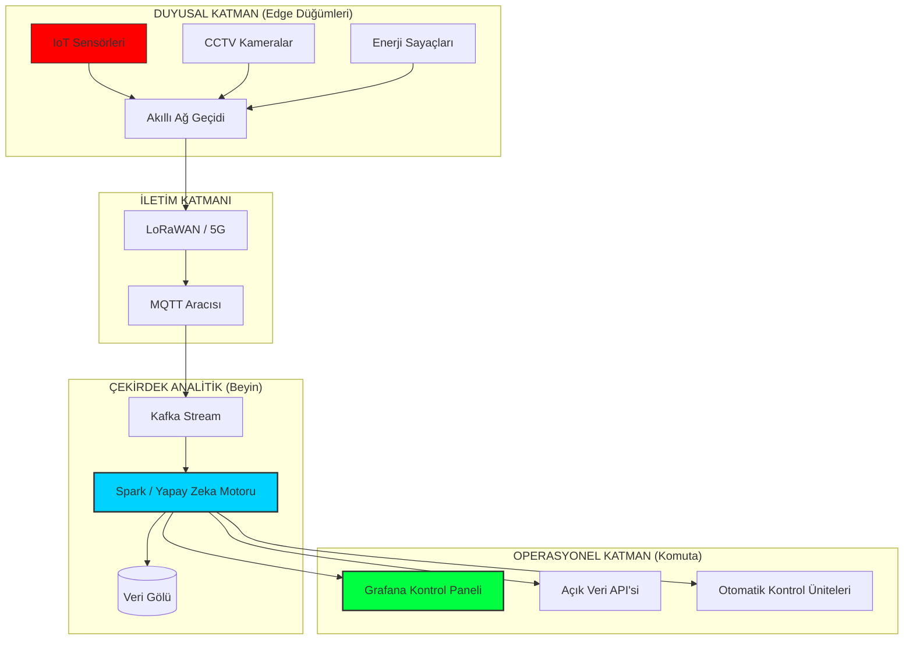

# 🏙️ CITY-OS: SÜRDÜRÜLEBİLİR METROPOL MİMARİSİ
> **Geleceğin Kentsel Ekosistemleri İçin Elit Komuta Merkezi**

---

## 🛰️ GÖREV GENEL BAKIŞI (MISSION OVERVIEW)
**City-OS**, sadece bir yazılım paketi değil; modern sürdürülebilir şehirlerin karmaşık kalp atışlarını yönetmek için tasarlanmış bir **Merkezi Kentsel İşletim Sistemi**'dir. Ulaşım, enerji ve kaynakları yüksek performanslı bir sistem mimarisi aracılığıyla uyumlaştırarak, City-OS beton yığınlarını kendi kendine yeten, akıllı organizmalara dönüştürür.

Bu proje, Birleşmiş Milletler'in **Sürdürülebilir Kalkınma Amaçları (SDG 11 - Sürdürülebilir Şehirler ve Topluluklar)** doğrultusunda, kentsel karmaşıklığı algoritmik bir hassasiyetle yönetmeyi hedefler.

### 🔳 ENTEGRE SİSTEM MODÜLLERİ (DEEP DIVE)
| Modül | Teknik Odak | Veri Kaynağı | Durum |
| :--- | :--- | :--- | :--- |
| **Mobility-X** | Dinamik Trafik Akışı | LiDAR / Computer Vision | `AKTİF` |
| **Energy-Grid** | Yük Dengeleme | SCADA / Akıllı Sayaçlar | `ENTEGRE EDİLİYOR` |
| **Eco-Watch** | Karbon Ayak İzi | Hava Kalitesi Sensörleri | `İZLENİYOR` |
| **Resilience-Core**| Anomali Tespiti | Sismik / Meteorolojik Veri | `BEKLEMEDE` |

---

## 🏛️ ÜST DÜZEY MİMARİ (HIGH-LEVEL ARCHITECTURE)

City-OS, **Katmanlı Dayanıklılık Mimarisi** (Layered Resilience Architecture) üzerine inşa edilmiştir. Veri akışı, en alttaki duyusal katmandan en üstteki karar destek mekanizmasına kadar milisaniyeler içinde gerçekleşir.

---

## 🚦 MODÜL DETAYLARI VE KENTSEL FELSEFE

### 1. AKILLI MOBİLİTE: Mobility-X
Trafik, bir şehrin dolaşım sistemidir. Mobility-X, bu sistemi açık tutmak için şu teknolojileri kullanır:
*   **Computer Vision Trafik Sayımı**: Kavşaklardaki kameralardan gelen verileri işleyerek yeşil ışık sürelerini araç yoğunluğuna göre dinamik olarak ayarlar.
*   **V2G (Vehicle-to-Grid) Entegrasyonu**: Şehirdeki elektrikli otobüslerin bataryalarını, pik enerji saatlerinde şehir şebekesine destek veren mobil kapasitörler olarak kullanır.
*   **Emisyon Odaklı Rotalama**: Google Maps'ten farklı olarak, sadece en hızlı yolu değil, en düşük karbon salınımına sahip multimodal yolları (bisiklet + raylı sistem kombinasyonu gibi) önerir.

### 2. ENERJİ OPTİMİZASYONU: Energy-Grid
Şehirlerin enerji tüketimi kaotiktir. Energy-Grid, bu kaosu disipline eder:
*   **Mikroşebeke Yönetimi**: Şehrin belirli bölgelerindeki (örneğin organize sanayi bölgeleri) güneş ve rüzgar panellerini bağımsız mikroşebekeler olarak yönetir. Merkezi sistem çökerse bu bölgeler kendi elektriğini üretmeye ve dağıtmaya devam eder.
*   **Yapay Zeka Destekli Talep Tahmini**: Geçmiş verileri (hava durumu, özel günler, saatlik kullanım) kullanarak enerji talebini %98 doğrulukla tahmin eder ve üretimi buna göre planlar.

### 3. EKOLOJİK DENGE: Eco-Watch
Görünmez tehlikeleri görünür kılın:
*   **Gerçek Zamanlı Hava Kalitesi Haritası**: PM2.5, NO2 ve CO seviyelerini sokak bazında takip ederek kirlilik limitleri aşıldığında trafik modülüne belirli bölgeleri kapatma komutu gönderir.
*   **Su Kayıpları Tespiti**: Akustik sensörler ile su borularındaki mikro sızıntıları dinler ve büyük bir patlama yaşanmadan bakım ekiplerini yönlendirir.

---

## 🛠️ TEKNOLOJİ YIĞINI (DEEP STACK)
> **Dayanıklılık, Ölçeklenebilirlik ve Ultra Düşük Gecikme İçin Mühendislik.**

*   **Backend (Core)**: 
    *   `Go`: Yüksek eşzamanlı veri işleme (MQTT Broker entegrasyonu).
    *   `Rust`: Kritik güvenlik modülleri ve bellek yönetimi.
*   **Data Pipeline**:
    *   `Apache Kafka`: Saniyede milyonlarca sensör verisinin kayıpsız iletimi.
    *   `TimescaleDB`: Kentsel zaman serisi verileri için optimize edilmiş PostgreSQL tabanlı veritabanı.
*   **Machine Learning**:
    *   `PyTorch`: Derin öğrenme tabanlı trafik ve enerji anomalisi tespiti.
    *   `TensorFlow Lite`: Edge cihazlarda (sensörlerin üzerinde) gerçek zamanlı çıkarım.
*   **Visualization**:
    *   `React + Three.js`: Şehrin 3D Digital Twin (Dijital İkiz) arayüzü.
    *   `Grafana`: Operasyonel metriklerin anlık takibi.

---

## 👨‍💻 BAŞ MİMAR (LEAD ARCHITECT)
**Bahattin Yunus Çetin** | *BT Mimarı & Teknoloji Vizyoneri*

Trabzon/Of ta ilim tahsil eden Bahattin, teknik uzmanlığını kent felsefesiyle birleştirerek zamana meydan okuyan sistemler inşa ediyor. Onun inancına göre: "Şehirler insanlık tarafından inşa edilmiş en büyük donanım platformlarıdır; biz buraya işletim sistemini sağlamak için geldik."

*   🌍 **Konum:** Trabzon, Türkiye
*   🔗 **LinkedIn:** [bahattinyunus](https://www.linkedin.com/in/bahattinyunus/)
*   💻 **GitHub:** [bahattinyunus](https://github.com/bahattinyunus)

---

## 🚀 REKABETÇİ VE STRATEJİK ÜSTÜNLÜK
1.  **Modüler Dayanıklılık**: Of gibi küçük yerleşim yerlerinden İstanbul gibi mega-metropollere kadar yatayda ölçeklenebilir; her yeni modül tak-çalıştır (Plug & Play) prensibiyle sisteme eklenir.
2.  **Proaktif Afet Müdahalesi**: Resilience-Core modülü sayesinde, sismik veriler ile enerji ve gaz hatlarını otonom olarak saniyeler içinde keserek ikincil felaketlerin önüne geçer.
3.  **Ekonomik Verimlilik**: ROI (Yatırım Getirisi) odaklı planlama sayesinde, sistem kurulum maliyetini enerji tasarrufu ve operasyonel verimlilikle 24-36 ay içinde amorti eder.

---
*“Geleceği kodluyoruz, her seferinde bir şehir.”*

© 2025 City-OS Projesi. Mimari: Bahattin Yunus Çetin.

  

